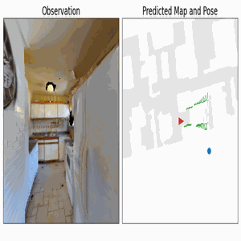

# SLAMuZero

## acme-more-mcts

## Installation
fork [acme-more-mcts](https://github.com/bwfbowen/acme-more-mcts) and run following command from the main directory(where `setup.py` is located):
```sh
pip install .[jax,tf,testing,envs]
```


Habitat is also needed:
```sh
pip install habitat-sim
pip install habitat-api
```

## Setup
The project requires datasets in a `data` folder in the following format (same as habitat-api):
```
SLAMuZero/
  data/
    scene_datasets/
      gibson/
        Adrian.glb
        Adrian.navmesh
        ...
    datasets/
      pointnav/
        gibson/
          v1/
            train/
            val/
            ...
```
Please download the data using the instructions here: https://github.com/facebookresearch/habitat-api#data

## Getting started
To run the code:
```python
python run_acme.py
```

## Visualization
Pass `--print_images 1` to plot trajectory
```sh
python run_acme.py --print_images 1
```

And use `draw.py` to generate `.gif`
```sh
python draw.py --pic_dir PATH_TO_DUMP 
```


